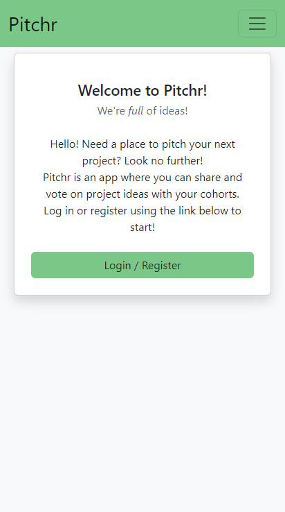

# Pitchr
Pitchr is a full stack web application where a user can pitch an idea for their next project, share, comment, and vote on project ideas. Registered to get started! 

# Table of Contents 
- [Table of Contents](#table-of-contents)
- [Dependencies](#dependencies)
- [Finished Product](#finished-product)
- [Installation and Usage](#installation-and-usage)
- [Collaborators](#collaborators)
- [Questions](#questions)

# Dependencies
- BCrypt Hash Password
- Bootstrap
- Node
- Insomnia
- Connect session sequelize
- Dotenv
- Express
- Express Handlebars
- Jest
- JS Confetti
- MySQL
- Sequelize

# Finished Product
Screenshot of desktop version

.png)

  

Screenshot of mobile version

# Installation and Usage
Pitchr was uploaded to the following GitHub repository:

[Pitchr Repo](https://github.com/blindsweatyhansolo/pitchr)

Pitchr was deployed using Heroku:

[Pitchr Deployed](https://pitchr314.herokuapp.com/)

# Collaborators
Jack S. https://github.com/blindsweatyhansolo/

Sam M.  https://github.com/samdakota

Hanna L. https://github.com/hlee92

# Questions
Got any questions? Reach out to any of our collaborators, we'll be glad to answer them!

